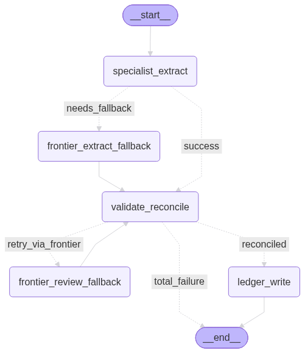

# Invoice Processing Pipeline

An end-to-end system that extracts structured data from invoices and receipts, validates it, and writes it to a reviewable ledger. A **fine-tuned small vision-language model** does the extraction cheaply; a **frontier model** is used only as a fallback when the specialist's output is malformed or fails validation. Processing is asynchronous and durable — jobs run on a Redis-backed task queue with automatic retries for transient failures — and every result, clean or not, requires a human verification before being considered final.

Every routing decision — retry, fallback, when to stop — is plain code checking state. The LLMs are only ever invoked to do one thing, extract structured JSON from an image, at fixed points in a [LangGraph](https://langchain-ai.github.io/langgraph/) state machine.

This is a personal project built to practice taking an LLM system all the way from *fine-tuning a model* to *running it as a service* — dataset preparation, training, serving, workflow orchestration, a task queue, a persistent ledger, an API, and a UI.

On a 124-document human-verified holdout, the fine-tuned 4B specialist reaches **0.915 macro-F1 / 0.958 micro-F1 with 100% schema conformance** — ahead of a Claude Opus 5 reference ceiling (0.879 / 0.955) on accuracy, behind it on latency. Details in [Evaluation](#evaluation).

## What it does

1. A user uploads an invoice/receipt image through the web UI (PNG or JPEG).
2. The backend saves the file, creates a `Job` record, and enqueues an extraction task on a Redis-backed queue ([Arq](https://arq-docs.helpmanual.io/)). A separate worker process picks it up.
3. A **fine-tuned Qwen3-VL** model (served via vLLM) extracts the invoice as structured JSON.
4. The output is validated against a Pydantic schema and **reconciled** — line items are summed against the subtotal, the grand total is recomputed from its components, and the invoice number is checked against the existing ledger for duplicates.
5. If the specialist's output is malformed or fails reconciliation, the workflow makes **one automatic retry with the frontier model** (Claude Haiku 4.5), re-prompting it with the specific issues found.
6. The result is written to the Postgres ledger. **Every entry requires a human verification** — reconciliation issues are surfaced to prioritize what a reviewer checks first, they don't gate whether a human ever sees it. Internal arithmetic consistency isn't proof the content is correct.
7. Failures are classified as retryable or permanent ([`workflow/error_categories.py`](src/invoice_pipeline/workflow/error_categories.py)): a transiently unreachable model endpoint is retried automatically with backoff; a malformed request or bad output is not, since retrying it would fail identically. Jobs that exhaust retries land in a small dead-letter view where they can be manually re-queued or deleted.

The design goal for model routing is cost: the cheap specialist handles the common case, and the expensive model is only invoked when something actually looks wrong. That's a separate concern from *review* — routing decides which model produces the draft; review decides whether it's trusted.

## Architecture

A React SPA uploads to a FastAPI backend, which saves the job and enqueues it on a Redis-backed task queue. A separate **Arq worker** process runs the extraction workflow and writes the outcome to Postgres — durable by design, so a backend restart mid-extraction doesn't lose in-flight work the way an in-process background task would.

The workflow itself is a LangGraph state machine with conditional routing, generated directly from the compiled graph:



A few of the edge labels are worth reading precisely:

- **`success` / `needs_fallback`** out of `specialist_extract` — routes on whether the specialist's raw output parsed into a valid `Invoice` at all, before reconciliation ever runs.
- **`reconciled`** out of `validate_reconcile` — despite the name, this fires in two cases: a genuinely clean extraction, *or* one that still has issues but has already used its one frontier retry. Either way, there's nothing left to gain by trying again, so it proceeds to `ledger_write`. It is not a claim that the entry is correct — only that automated retries are exhausted.
- **`retry_via_frontier`** — only reachable when the *specialist's* draft has issues and the frontier hasn't been tried yet; the one retry the system spends before asking a human.
- **`total_failure`** — `invoice` came back `None` from both models; skips `ledger_write` entirely rather than persisting an empty or fabricated row. The job still surfaces in the review queue (`Job.status == "extraction_failed"`), and a reviewer fills it in from scratch.

| Node | Responsibility |
|---|---|
| `specialist_extract` | Call the fine-tuned model; on a parse failure, route to the frontier extractor |
| `validate_reconcile` | Run schema, arithmetic, and duplicate checks |
| `frontier_extract_fallback` | Re-extract with the frontier model when the specialist's output is unusable |
| `frontier_review_fallback` | One retry with the reconciliation issues fed back as context |
| `ledger_write` | Persist the entry — every entry, always flagged for human confirmation, regardless of which edge led here |

Retryable failures (a model endpoint being briefly unreachable) never reach `ledger_write` at all — they propagate uncaught out of the extractor and out of the whole graph, straight to the worker's retry/backoff logic, so Arq can retry the identical call later. Everything else (bad input, malformed output) is caught inside the extractor and routed through the graph as a normal result.

The code is layered so each concern has one owner:

| Module | Owns |
|---|---|
| [`workflow/extractors.py`](src/invoice_pipeline/workflow/extractors.py) | The two model clients — no graph or state knowledge |
| [`workflow/error_categories.py`](src/invoice_pipeline/workflow/error_categories.py) | Classifies a failure as retryable ("connectivity") or permanent |
| [`workflow/nodes.py`](src/invoice_pipeline/workflow/nodes.py) | Translating graph state to and from the extractors |
| [`workflow/graph.py`](src/invoice_pipeline/workflow/graph.py) | Graph wiring; the single place dependencies are constructed |
| [`workflow/runner.py`](src/invoice_pipeline/workflow/runner.py) | Running the graph and returning a public `ExtractionResult` |
| [`workflow/images.py`](src/invoice_pipeline/workflow/images.py) | Loading and downscaling an image to base64 for either model |
| [`queue/worker.py`](src/invoice_pipeline/queue/worker.py) | The Arq worker: runs the workflow per job, owns the retry/backoff and terminal-failure policy |
| [`queue/pool.py`](src/invoice_pipeline/queue/pool.py) | The Redis connection pool the API enqueues jobs through |
| [`config.py`](src/invoice_pipeline/config.py) | Model, queue, and upload-path settings |

The graph's internal state never escapes the workflow package, so the HTTP layer stays purely about HTTP. Validation logic lives in [`reconciliation.py`](src/invoice_pipeline/reconciliation.py).

## The model

The specialist is **Qwen3-VL-4B-Instruct**, fine-tuned with **LoRA (SFT)** using [Unsloth](https://github.com/unslothai/unsloth), with runs tracked in **MLflow**. The served checkpoint adapts the vision layers alongside the language, attention, and MLP modules (`r=8`, `lr=2e-4`, 3 epochs, best `eval_loss` 0.017); vision-frozen variants were trained as a comparison arm and are kept under `outputs/*-novision/`. The adapter is merged into the base weights and served through **vLLM**'s OpenAI-compatible API.

Training data is pooled from three sources ([`scripts/build_training_splits.py`](scripts/build_training_splits.py)) — 3,985 train / 443 val:
- **[CORD](https://github.com/clovaai/cord)** (814) and **[SROIE](https://huggingface.co/datasets/darentang/sroie)** (546) — real receipts, converted via locale-aware number parsers ([`scripts/converters/`](scripts/converters/)) that handle mixed `.`/`,` thousands/decimal conventions.
- **[FATURA](https://huggingface.co/datasets/mathieu1256/FATURA2-invoices)** (2,625) — synthetic invoices, labeled by running a **Qwen3-VL-32B-Instruct** model locally via Unsloth with vLLM's continuous batching, on a rented GPU.

- Training: [`scripts/train_qwen_vl.py`](scripts/train_qwen_vl.py)
- Serving locally: [`scripts/serve_vllm.sh`](scripts/serve_vllm.sh) — the `--served-model-name` it passes must match `SPECIALIST_MODEL` in the environment, or the specialist call 404s
- Serverless GPU serving: [`deploy/modal_app.py`](deploy/modal_app.py) — deploys the merged model to a Modal **L4** GPU as an autoscaling web server. `@modal.concurrent(max_inputs=16)` with `max_containers=1` was a deliberate, measured fix: without it, Modal serializes one request per container regardless of vLLM's own continuous batching, which throttled throughput to roughly one document every 50 seconds. With it, concurrent requests actually reach vLLM's batching engine.

### Data splits and the golden set

`data/` is not committed. The split builder ([`scripts/build_training_splits.py`](scripts/build_training_splits.py)) holds out a golden fraction per source *before* carving train/val, so a single run produces a clean three-way split with no overlap between the holdout and either training split.

The benchmark set at `data/golden/test.jsonl` is **124 human-verified documents** — 26 CORD, 81 FATURA, 17 SROIE.

## Evaluation

[`src/invoice_pipeline/eval/`](src/invoice_pipeline/eval/) runs an extractor over the 124-document golden set and scores each prediction against the human-verified gold record, field by field. Two arms: the **specialist** (fine-tuned Qwen3-VL-4B on a Modal L4) and **Claude Opus 5** as a *reference ceiling* — deliberately stronger than the Haiku 4.5 that serves as the actual production fallback, so the specialist is measured against a good frontier result rather than a convenient one.

### Headline

| | Specialist (Qwen3-VL-4B, LoRA) | Claude Opus 5 (ceiling) |
|---|---|---|
| Documents | 124 | 124 |
| Schema conformance | 100.0% | 100.0% |
| Overall macro-F1 | **0.915** | 0.879 |
| Overall micro-F1 | **0.958** | 0.955 |
| Latency p50 | 13.89s | **8.88s** |
| Latency p95 | 19.95s | **11.52s** |

Both arms parsed into a valid `Invoice` on all 124 documents. For the specialist that comes from constrained decoding — the request pins `response_format` to a strict `json_schema`, so vLLM can only emit tokens the grammar admits. Before that was wired in, malformed output was the main driver of frontier fallbacks.

### By source

| Source | n | Specialist macro / micro | Opus 5 macro / micro |
|---|---|---|---|
| CORD (receipts) | 26 | **0.915** / 0.920 | 0.820 / 0.875 |
| FATURA (synthetic invoices) | 81 | **0.904** / **0.983** | 0.891 / 0.981 |
| SROIE (receipts) | 17 | 0.759 / 0.649 | 0.722 / **0.878** |
| SROIE, trained fields only | 17 | 0.947 / 0.947 | **0.971** / **0.971** |

### What the numbers say

- **The specialist wins on macro-F1 because it hallucinates less.** Opus 5's losses are concentrated in fields it invents where the gold record has nothing — 30 nonexistent vendors (`vendor` precision 0.720 vs. the specialist's 0.987) and 17 fabricated `vendor.tax_id`s, all on receipts that have none. Recall is 1.000 on those fields for both arms: the frontier isn't missing anything, it's adding things. Fine-tuning taught the schema's null convention in a way prompting did not.
- **The specialist's failure mode is the mirror image: it omits — and it's almost all SROIE.** 44 of its 47 missed line items are on that source (`line_items` F1 0.136 there; `invoice_number` never emitted). This is label coverage, not capacity: the SROIE training source only ever labels company/date/address/total, so the model learned that receipt-shaped input has nothing else. Restricted to those four trained fields it scores 0.947. The fix is relabeling SROIE, not retraining harder.
- **The frontier is ahead on `grand_total`** (0.960 vs. 0.903) — and both models are weakest on `subtotal` and `tax` (F1 ≈ 0.75–0.80), exactly the fields the reconciliation step recomputes.
- **The specialist is slower** — a 4B model on one autoscaling L4 vs. a hyperscaler API. Its case rests on per-document cost, which this harness doesn't measure.

<details>
<summary><strong>Per-field breakdown</strong> (overall, 124 documents)</summary>

`document_type`, `currency`, and `grand_total` are required, so they are scored as accuracy and excluded from the macro/micro-F1 figures, which cover the nullable fields only. `n` is the field's support (`tp + fp + fn`). Per-source breakdowns come from the same runner (see [Reproducing](#reproducing)).

| Field | Metric | Specialist | Opus 5 |
|---|---|---|---|
| `document_type` | accuracy | **1.000** (124) | 0.984 (124) |
| `currency` | accuracy | **0.992** (124) | 0.976 (124) |
| `grand_total` | accuracy | 0.903 (124) | **0.960** (124) |
| `invoice_number` | P / R / F1 | 1.000 / 0.835 / 0.910 (91) | 0.978 / 1.000 / **0.989** (93) |
| `issue_date` | P / R / F1 | 0.978 / 0.958 / 0.968 (97) | 0.989 / 0.989 / **0.989** (96) |
| `due_date` | P / R / F1 | 1.000 / 0.905 / **0.950** (42) | 0.930 / 0.952 / 0.941 (45) |
| `subtotal` | P / R / F1 | 0.818 / 0.717 / **0.764** (131) | 0.800 / 0.708 / 0.751 (133) |
| `tax` | P / R / F1 | 0.821 / 0.719 / 0.767 (74) | 0.768 / 0.828 / **0.797** (80) |
| `service_charge` | P / R / F1 | 0.750 / 0.600 / **0.667** (6) | 0.500 / 0.600 / 0.545 (8) |
| `discount` | P / R / F1 | 0.812 / 0.765 / 0.788 (20) | 0.727 / 0.941 / **0.821** (23) |
| `vendor` | P / R / F1 | 0.987 / 1.000 / **0.994** (78) | 0.720 / 1.000 / 0.837 (107) |
| `vendor.name` | P / R / F1 | 0.974 / 0.974 / 0.974 (79) | 0.987 / 0.987 / **0.987** (78) |
| `vendor.address` | P / R / F1 | 0.984 / 0.984 / 0.984 (65) | 0.970 / 1.000 / **0.985** (66) |
| `vendor.tax_id` | P / R / F1 | 1.000 / 1.000 / **1.000** (17) | 0.500 / 1.000 / 0.667 (34) |
| `vendor.iban` | P / R / F1 | 0.333 / 1.000 / **0.500** (3) | 0.100 / 1.000 / 0.182 (10) |
| `customer` | P / R / F1 | 1.000 / 1.000 / **1.000** (71) | 0.947 / 1.000 / 0.973 (75) |
| `customer.name` | P / R / F1 | 1.000 / 1.000 / 1.000 (71) | 1.000 / 1.000 / 1.000 (71) |
| `customer.address` | P / R / F1 | 1.000 / 1.000 / 1.000 (71) | 1.000 / 1.000 / 1.000 (71) |
| `customer.tax_id` | P / R / F1 | 1.000 / 1.000 / 1.000 (4) | 1.000 / 1.000 / 1.000 (4) |
| `customer.iban` | P / R / F1 | 1.000 / 1.000 / 1.000 (0) | 1.000 / 1.000 / 1.000 (0) |
| `line_items` | P / R / F1 | 0.972 / 0.880 / 0.923 (401) | 0.970 / 0.992 / **0.981** (403) |
| `line_items.description` | P / R / F1 | 0.994 / 0.994 / **0.994** (346) | 0.966 / 0.966 / 0.966 (401) |
| `line_items.unit_price` | P / R / F1 | 0.967 / 0.987 / **0.977** (309) | 0.910 / 0.994 / 0.950 (368) |
| `line_items.quantity` | P / R / F1 | 0.997 / 0.991 / **0.994** (342) | 0.990 / 0.995 / 0.992 (389) |
| `line_items.line_total` | P / R / F1 | 0.977 / 0.977 / 0.977 (352) | 0.990 / 0.990 / **0.990** (392) |

</details>

### How a field is scored

Scoring is deliberately unforgiving of hallucination: every nullable field is judged on presence first (`tp`/`fp`/`fn`/`tn`), and a value present in both but *wrong* is charged as both a false positive and a false negative — a wrong answer costs strictly more than an omission. Strings match by ANLS (normalized Levenshtein, 0.5 floor), money as `Decimal` with 0.01 tolerance, and line items order-independently via Hungarian assignment ([`eval/align.py`](src/invoice_pipeline/eval/align.py)) — unmatched predictions count as hallucinations, unmatched gold items as misses.

### Reproducing

Requires the golden set under `data/` and a running specialist endpoint:

```bash
uv run python -m invoice_pipeline.eval.runner --extractor specialist --seed 42
uv run python -m invoice_pipeline.eval.runner --extractor frontier --model claude-opus-5
```

## The schema

Extraction targets a strict Pydantic model ([`src/invoice_pipeline/schema.py`](src/invoice_pipeline/schema.py)) with `extra="forbid"`: an `Invoice` with typed `Party` (vendor/customer), `LineItem`s, `Decimal` money fields, an ISO-4217 currency pattern, and a `document_type` literal (`invoice` / `receipt`). Using `Decimal` throughout keeps the reconciliation arithmetic exact.

## Backend

- **FastAPI**, fully async, backed by **Redis** + **Arq** for durable job processing. Upload saves the file, creates a `Job` row, and enqueues an extraction task; a separate worker process consumes it, so a backend restart never orphans in-flight work.
- **Postgres** ledger via **SQLModel**, with **Alembic** migrations ([`alembic/versions/`](alembic/versions/)). Two tables: `Job` (processing lifecycle — status, retry `attempts`, last error) and `LedgerEntry` (the extracted invoice + review state).
- Routers for extraction ([upload / status / image](src/invoice_pipeline/api/routers/extraction.py)) and the ledger ([review queue / full ledger / pending / errored / edit / delete / retry](src/invoice_pipeline/api/routers/ledger.py)).
- Retries are automatic for retryable failures, with backoff; a job that exhausts its retries is marked `error` and surfaced separately from the review queue (which is for entries with real invoice data to correct) — it can be manually re-queued via `POST /ledger/{job_id}/retry` or deleted.

## Frontend

**React + Vite + Tailwind** SPA with five views: an upload page (with live panels for jobs still processing and jobs that failed permanently, each with retry/delete actions), a review queue (every unconfirmed entry), the full ledger (confirmed entries), a per-job detail view showing the original image alongside the extracted data, and an edit form for human correction. See [`frontend/`](frontend/).

## Running it

```bash
# Backend + Postgres + Redis + worker + frontend
docker compose up

# The stack does not run migrations itself. Build the schema once against the
# compose Postgres (published on :5434) before the first run:
POSTGRES_HOST=localhost POSTGRES_PORT=5434 uv run alembic upgrade head
```

Or locally, with Postgres and Redis already running:

```bash
uv sync
uv run alembic upgrade head                                  # build the schema
uv run fastapi dev src/invoice_pipeline/api/main.py          # backend
uv run arq invoice_pipeline.queue.worker.WorkerSettings      # worker
cd frontend && npm install && npm run dev                    # frontend
```

`alembic upgrade head` builds the schema from empty — the chain starts by creating `ledgerentry` and `job`, then applies every change on top. It produces a schema identical to `SQLModel.metadata.create_all` (what [`scripts/init_db.py`](scripts/init_db.py) does), so the two setup paths can't drift.

Configuration is a `.env` file at the repo root:

| Variable | Used for |
|---|---|
| `POSTGRES_HOST` · `POSTGRES_PORT` · `POSTGRES_PASSWORD` | Ledger. Host and password are required — the process refuses to import without them |
| `REDIS_HOST` · `REDIS_PORT` | Task queue |
| `VLLM_BASE_URL` · `VLLM_API_KEY` · `SPECIALIST_MODEL` | The specialist endpoint, served separately (see above) |
| `ANTHROPIC_API_KEY` · `FRONTIER_MODEL` | The frontier fallback |

Model, queue, and upload settings load in [`config.py`](src/invoice_pipeline/config.py); the Postgres variables are read independently in [`db/engine.py`](src/invoice_pipeline/db/engine.py), so environment loading isn't quite in one place yet.

## Tests & CI

219 tests ([`tests/`](tests/)) across the workflow's routing and fallback logic, the extractors and their retryable/permanent error split, the task queue worker, the graph runner, reconciliation, image loading, the CORD converter, the training-data adapter, the schema, DB operations, the API routers, and the evaluation harness (alignment, comparison, metrics, reporting, and the runner). CI ([`.github/workflows/ci.yml`](.github/workflows/ci.yml)) runs `ruff` lint + format checks and the full `pytest` suite on every push.

## Tech stack

**ML / serving:** PyTorch · Unsloth · LoRA/SFT · Qwen3-VL · vLLM · MLflow · Modal
**Backend:** Python 3.12 · FastAPI · Pydantic · LangGraph · Redis · Arq · SQLModel · Alembic · Postgres · Docker
**Frontend:** React · Vite · Tailwind · React Router
**Frontier fallback:** Claude Haiku 4.5 (LangChain, structured output)

## Status & known limitations

This is an actively-developed learning project, not a production product. Honest caveats:

- **The benchmark set is small and single-reviewer.** 124 documents verified by one person, with single-digit support on some fields — individual per-field numbers carry wide error bars; the headline macro/micro-F1 figures are the ones that hold up.
- **No base-model arm.** The eval doesn't compare against un-tuned Qwen3-VL-4B, so it shows where the specialist stands, not how much the fine-tuning itself bought. That's the obvious next run — along with per-document cost, which the routing design is premised on but the harness doesn't measure.
- **No observability/tracing wired in.** Nothing currently traces a run's prompts, latency, or the specialist-vs-frontier split per job.
- **No auth.** The API and UI are wide open — fine for local/personal use, not for anything multi-user.
- Training data leans template-heavy (FATURA is synthetic) and receipt-heavy (CORD/SROIE); real-world invoice layout diversity is still limited, so out-of-domain documents lean more on the frontier fallback.
- Uploaded files are stored on **local disk** (no S3/object storage) — deliberately scoped down for a personal project.
